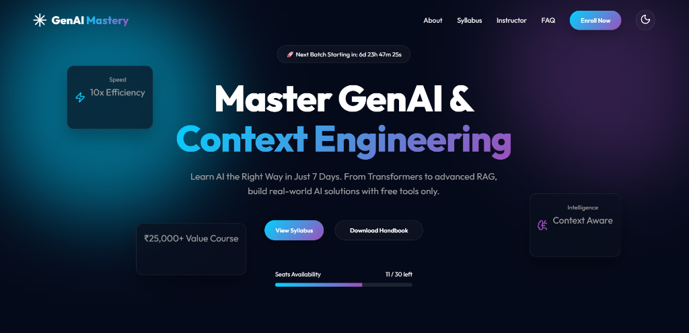
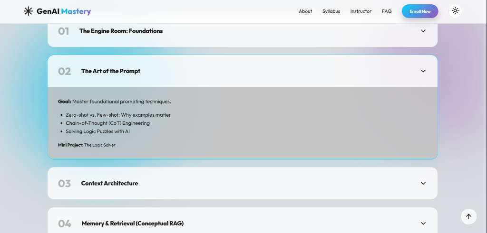
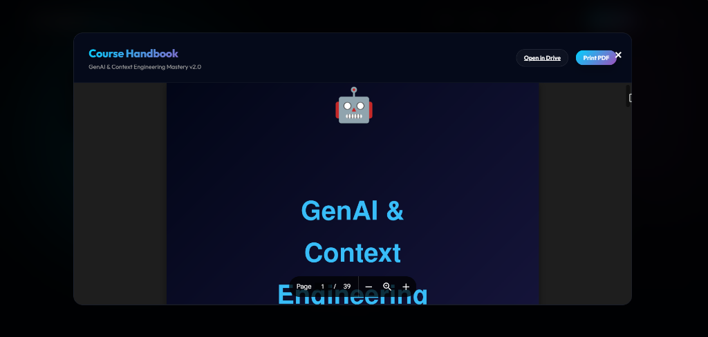
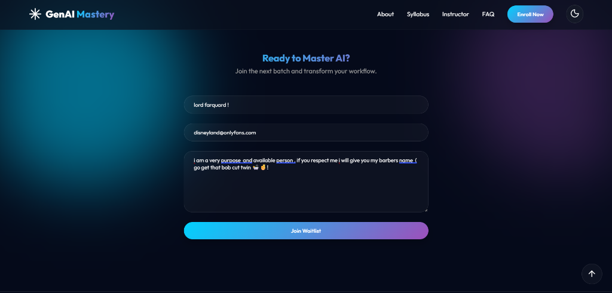

# 🚀 GenAI & Context Engineering Mastery Bootcamp

## A Premium, Ultra-Modern Landing Page & Interactive Syllabus Hub

[](https://developer.mozilla.org/en-US/docs/Web/HTML)
[](https://developer.mozilla.org/en-US/docs/Web/CSS)
[](https://developer.mozilla.org/en-US/docs/Web/JavaScript)
[](https://sunny-bienenstitch-7c7f1f.netlify.app/)

Welcome to the official repository for the **GenAI & Context Engineering Mastery Bootcamp** landing page. This web application serves as a high-converting, premium marketing landing page and interactive curriculum dashboard. It presents a comprehensive, fast-paced 7-day bootcamp roadmap covering everything from Transformer foundations to advanced Retrieval-Augmented Generation (RAG) and Context Architecture.

> [!NOTE]
> 💡 **A Note from the Author:** 
> This project is a milestone for me—**it is my first web application ever!** It represents my transition into web development, focusing on building high-fidelity interfaces, modular interactions, and responsive design systems.

---

## 🛠️ Technology Stack

This application is built entirely on a vanilla front-end stack for maximum speed, simplicity, and efficiency:

*   **HTML5** ([index.html](file:///C:/Users/anike/Downloads/genai-context-main/genai-context-main/genai-bootcamp/index.html)): Structured semantic layout featuring bento-grid layouts, custom modals, and SVG graphics.
*   **Vanilla CSS3** ([style.css](file:///C:/Users/anike/Downloads/genai-context-main/genai-context-main/genai-bootcamp/style.css)): Fully custom UI styling utilizing HSL-tailored colors, high-end glassmorphism, responsive flex/grid layouts, smooth animations (moving mesh background blobs), and unified design tokens.
*   **Vanilla JavaScript** ([script.js](file:///C:/Users/anike/Downloads/genai-context-main/genai-context-main/genai-bootcamp/script.js)): Client-side orchestration for the fuzzy-search syllabus engine, expandable accordions, interactive countdown timer, randomized seat availability progress bar, dark/light mode toggle, and modal controls.
*   **Lucide Icons**: Modern SVG icon library loaded via CDN to elevate visual aesthetics.

---

## 🌟 Key Features

1.  **Premium Aesthetics & Theme Support**:
    *   **Animated Blob Mesh**: Soft CSS gradients shift slowly in the background to capture user attention.
    *   **Glassmorphism Cards**: Semi-transparent overlays create depth and a modern software-as-a-service feel.
    *   **Seamless Light/Dark Mode**: Dynamic style toggle allows users to switch modes instantly without content shift.
2.  **Interactive 7-Day Curriculum**:
    *   **Real-time Search Filter**: Users can filter syllabus topics on-the-fly (e.g., searching "RAG" automatically displays Days 4 & 6 and hides others).
    *   **Accordion Details**: Clean expand/collapse animations for each day showing course goals, topics, and mini-projects.
3.  **Handbook PDF Integration**:
    *   **Pre-download Dialog**: A premium popup modal explaining handbook contents.
    *   **Embedded Viewer**: Google Drive PDF iframe integration with "Print PDF" and cross-origin fallback redirects.
4.  **Enrollment Simulation**:
    *   **Live Countdown**: Visual countdown badge showing the next batch start date.
    *   **Scarcity Indicator**: Auto-updating progress bar simulating seats filling up.
    *   **Waitlist Form**: Client-validated form with submission feedback states ("Applying..." to "Successfully Joined!").

---

## 📸 Screen Gallery

Check out the responsive layout of the web application in action:

| 🌌 Hero Section (Dark Mode) | 💡 Syllabus & Curriculum (Light Mode) |
| :---: | :---: |
|  |  |

| 📄 Embedded Handbook Modal | ✍️ Waitlist Registration Form |
| :---: | :---: |
|  |  |

---

## 🚀 Live Deployment

The application is deployed and publicly accessible online:
🔗 **[Visit GenAI & Context Engineering Mastery Bootcamp](https://sunny-bienenstitch-7c7f1f.netlify.app/)**

---

## ⚙️ How to Run Locally

If you want to spin up a local instance of the landing page, follow these instructions:

1.  **Clone the Repository**:
    ```bash
    git clone https://github.com/YOUR_USERNAME/genai-context-main.git
    ```
2.  **Navigate to the Bootcamp Directory**:
    ```bash
    cd genai-context-main/genai-context-main/genai-bootcamp
    ```
3.  **Open the Application**:
    *   *Direct Access*: Double-click the [index.html](file:///C:/Users/anike/Downloads/genai-context-main/genai-context-main/genai-bootcamp/index.html) file to open it in your browser.
    *   *Local Server (Recommended)*: For the best experience (including the PDF iframe modal), run a local server:
        ```bash
        # Python 3
        python -m http.server 8000
        
        # Node.js
        npx serve
        ```
        Then, open `http://localhost:8000` or `http://localhost:3000` in your web browser.

---

## 🐛 Bugs & Troubleshooting (For Developers)

*   **PDF Cross-Origin Printing**: Standard security policy might block the direct printing of Google Drive PDFs within an iframe (`printIframe()` function). If blocked, the script automatically triggers a graceful fallback, opening the document in a new window tab.
*   **Fuzzy Search Performance**: The search filter targets the custom element attributes `data-topics` and `h3` tags. If you expand the curriculum, remember to add your search terms to the `data-topics` attribute of the corresponding `.day-card` in [index.html](file:///C:/Users/anike/Downloads/genai-context-main/genai-context-main/genai-bootcamp/index.html).
*   **Theme Storage**: The toggle sets the `data-theme` attribute on the `<body>` element. If customizing color themes, look at the variable definitions in the header of [style.css](file:///C:/Users/anike/Downloads/genai-context-main/genai-context-main/genai-bootcamp/style.css).

---

## ⚠️ Known Limitations & Architecture

Please note the following technical constraints for this version of the project:

*   **No Authentication / Login Logic**: The page is fully static and does not have user authentication flows.
*   **No Database or Backend Integration**: Waitlist submissions are processed entirely on the client-side. Form inputs are simulated and do not persist to a database or trigger actual emails.

> [!IMPORTANT]
> **Looking for the Full-Stack Version?**
> If you are looking for a complete version of this application that features **user login, database persistence, secure backend form-handling, and session states**, please check my **other GitHub repositories**. You will find a full-stack version of this project containing a database connection and secure login logic!

---

## 🤝 Let's Connect & Be Friends!

Since this is my very first web application, I would love to connect, get your feedback, and collaborate! Feel free to reach out and follow my social profiles:

*   **GitHub**: [@AniketDaiya](https://github.com/AniketDaiya) 🚀
*   **LinkedIn**: [in/aniket-daiya-1473b93a3](https://www.linkedin.com/in/aniket-daiya-1473b93a3/) 💼
*   **Email**: [aniketdaiya0910@gmail.com](mailto:aniketdaiya0910@gmail.com) 📧

*Thank you for visiting my project! If you like what you see, feel free to give the repository a ⭐️!*
